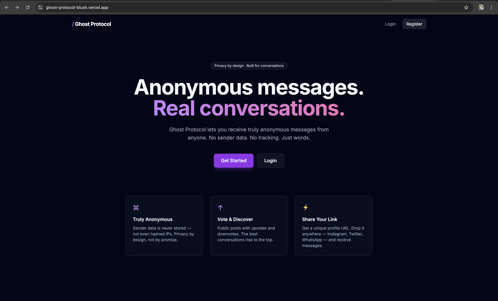
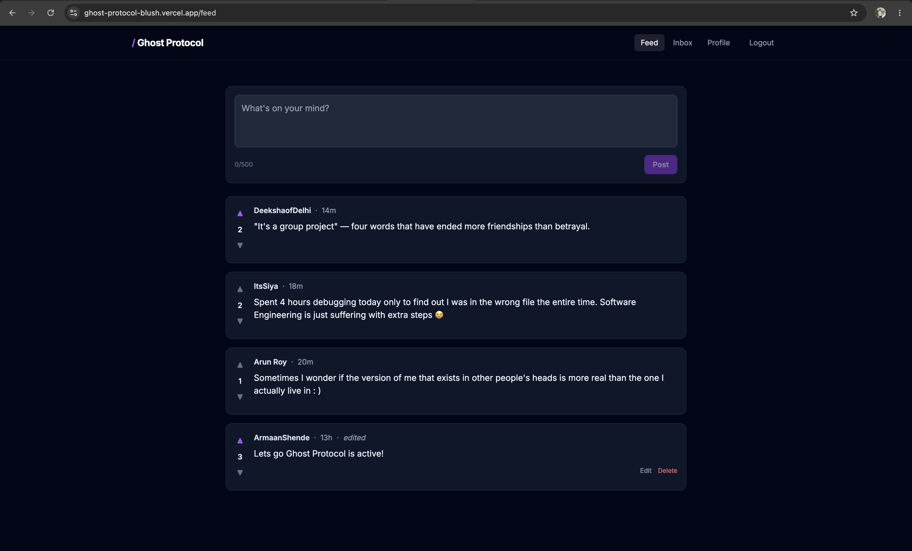
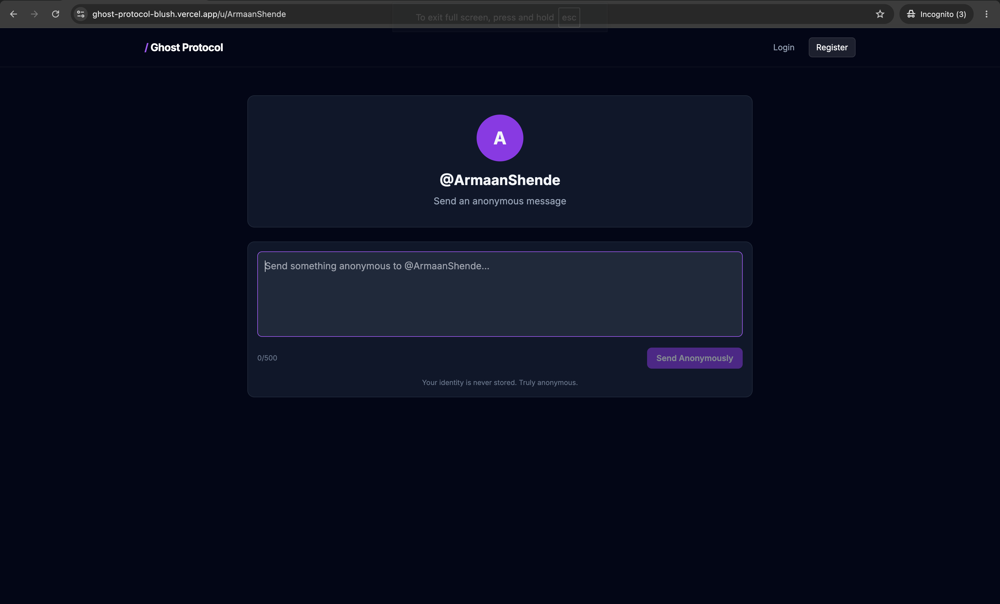
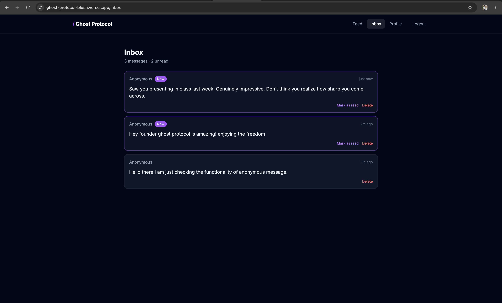

# Ghost Protocol

> Anonymous messages. Real conversations.

A privacy-first social platform combining NGL-style anonymous messaging with a public posts feed. Built end-to-end with the MERN stack and deployed on Vercel + Render.

**🔗 Live Demo:** [ghost-protocol-blush.vercel.app](https://ghost-protocol-blush.vercel.app)

---

## Screenshots

### Landing Page


### Public Feed with Voting


### Anonymous Message Form


### Inbox


---

## Features

- **Truly anonymous messaging** — no sender data stored, not even hashed IPs
- **Public posts** with upvote/downvote system
- **Inline post editing** with "edited" indicator
- **JWT-based authentication** with bcrypt password hashing
- **Shareable profile links** — drop anywhere to receive anonymous messages
- **Rate limiting** on auth and messaging endpoints
- **Security headers** via Helmet
- **Responsive dark UI** with glassmorphism design

---

## Tech Stack

**Frontend**
- React 18 (Vite)
- React Router 6
- Tailwind CSS
- Axios
- Context API for global auth state

**Backend**
- Node.js + Express 4
- MongoDB Atlas with Mongoose 9
- JSON Web Tokens (JWT)
- bcrypt for password hashing
- express-rate-limit, helmet

**Infrastructure**
- Frontend: Vercel
- Backend: Render
- Database: MongoDB Atlas (Singapore region)

---

## Architecture Highlights

- **Layered backend** — routes → middleware → controllers → models, with no business logic leaking across layers
- **Embedded vote arrays** on posts (`upvotes: [ObjectId]`, `downvotes: [ObjectId]`) chosen over a separate Votes collection for sub-millisecond reads at expected scale; documented migration path to a Votes collection when posts exceed ~100K votes
- **Virtual `score` field** computed on read to avoid denormalization drift
- **Zero-knowledge messaging** — `Message` schema deliberately omits any sender field; recipients are resolved by username lookup, then the sender's identity is dropped at the API boundary
- **N+1 prevented** via Mongoose `.populate('author', 'username')` on feed reads
- **Authorization at controller layer** with `ObjectId.toString()` comparison to prevent IDOR

---

## Running Locally

### Prerequisites
- Node.js 18+
- MongoDB Atlas connection string (free tier works)

### Setup

```bash
# Clone the repo
git clone https://github.com/ArmaanShende/ghost-protocol.git
cd ghost-protocol

# Backend
cd server
npm install
cp .env.example .env   # then fill in MONGODB_URI and JWT_SECRET
npm run dev

# Frontend (new terminal)
cd ../client
npm install
npm run dev
```

Backend runs on `http://localhost:8000`, frontend on `http://localhost:5173`.

### Environment Variables

**`server/.env`**
```
PORT=8000
MONGODB_URI=your_mongodb_connection_string
JWT_SECRET=your_secret_here
JWT_EXPIRE=7d
NODE_ENV=development
CLIENT_URL=http://localhost:5173
```

**`client/.env`**
```
VITE_API_URL=http://localhost:8000/api
```

---

## API Endpoints

### Auth
- `POST /api/auth/register` — create account
- `POST /api/auth/login` — log in, returns JWT
- `GET /api/auth/me` — get current user (protected)

### Posts
- `GET /api/posts` — list all posts
- `POST /api/posts` — create post (protected)
- `PATCH /api/posts/:id` — edit own post (protected)
- `DELETE /api/posts/:id` — delete own post (protected)
- `POST /api/posts/:id/vote` — upvote/downvote (protected)

### Messages
- `POST /api/messages/:username` — send anonymous message (public)
- `GET /api/messages` — get own inbox (protected)
- `PATCH /api/messages/:id/read` — mark message as read (protected)
- `DELETE /api/messages/:id` — delete message (protected)

---

## Roadmap (v2)

- [ ] Cursor-based pagination on feed
- [ ] Nested comments with cascading delete
- [ ] Image upload via Cloudinary
- [ ] CAPTCHA on public message form
- [ ] Per-user word filters for incoming messages
- [ ] Report system with admin moderation

---

## License

MIT — built by [Armaan Shende](https://github.com/ArmaanShende) as a learning project.